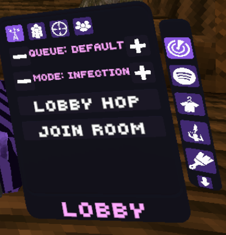

# hey, i'm idiotthemodder 🐒

i mod Gorilla Tag and mess around with reverse engineering in my free time. everything here is rebuilt from source, no ripped binaries.

- 🐒 building/rebuilding mods for **Gorilla Tag** — mod checkers, camera mods, HUDs
- 🔍 learning RE through crackmes.one — rizin, cutter, ghidra, pwndbg
- 🐧 daily driving **CachyOS** (Arch-based Linux) on Hyprland
- 🥽 VR stuff on a Quest 3, streaming with WiVRn

---

## projects

### [sakuraa-mod-checker](https://github.com/idiotthemodder/Sakuraa-mod-checker)
rebuild of the Sakuraa Gorilla Tag mod checker + camera mod from decompiled source. tracks known mods/cheats, flags unknowns, full in-game menu with nametag customization, VR map loader, live list sync, and more.

<!-- swap these for your own screenshots/gifs, keep width consistent -->

  
  
  

full feature list

- known mod/cheat list with confidence labels
- unknown-property logger + in-menu "file as mod/cheat/unsure" buttons
- wildcard version matching for menus that change property names
- nametag colors by category, fade with distance, hide friends
- VR map loader
- live list reload + github auto-sync
- theme editor, changelog page, about page

---

### [lyricshud](https://github.com/idiotthemodder/lyricshud)
BepInEx plugin that puts a live lyrics/music HUD in Gorilla Tag, paired with a python helper for fetching lyrics and track info. shows artist, track art, and synced lyrics in-headset.

  

---

### [sakuraa-lists](https://github.com/idiotthemodder/sakuraa-lists)
mod/cheat list data consumed by the mod checker, pulled automatically via the github sync.

---

## setup

CachyOS · Hyprland · fish · kitty · Midnight shell · i7-13700F · RTX 3060

decompiled/rebuilt mods in my repos never ship the original ripped DLLs — source only, build it yourself.
